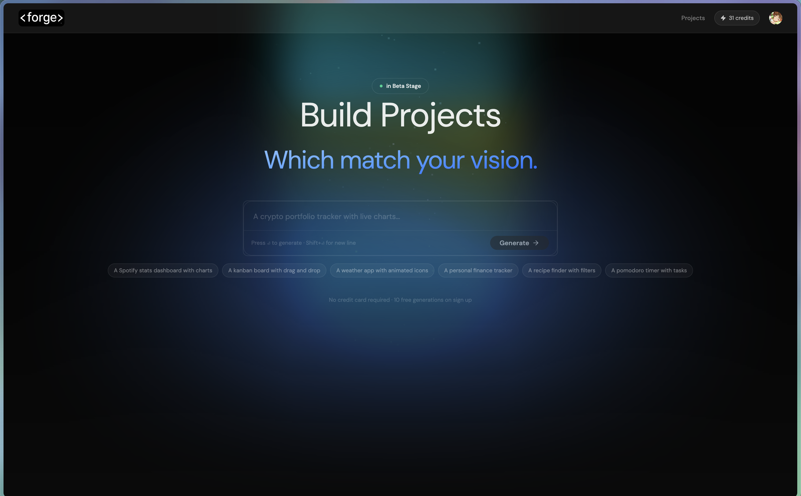
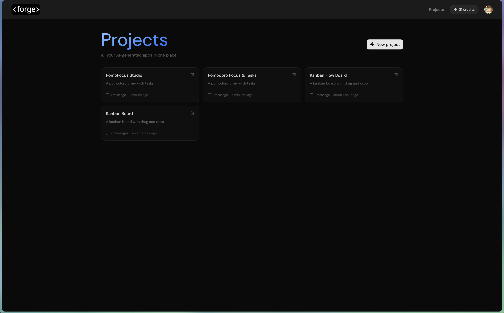
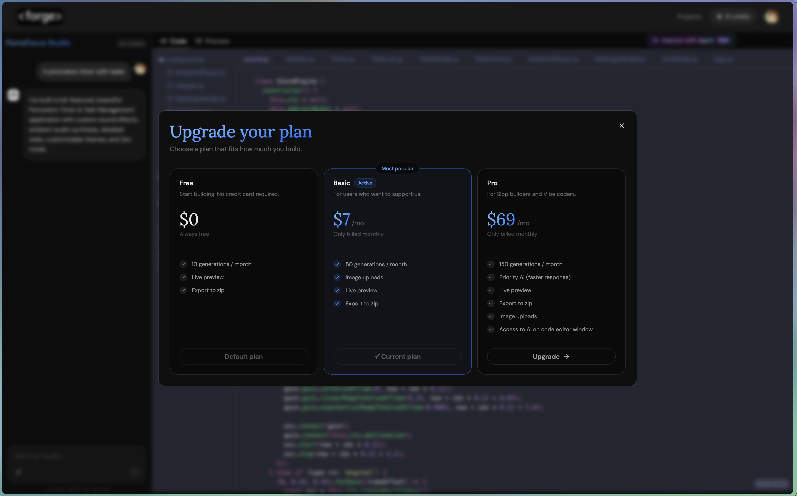
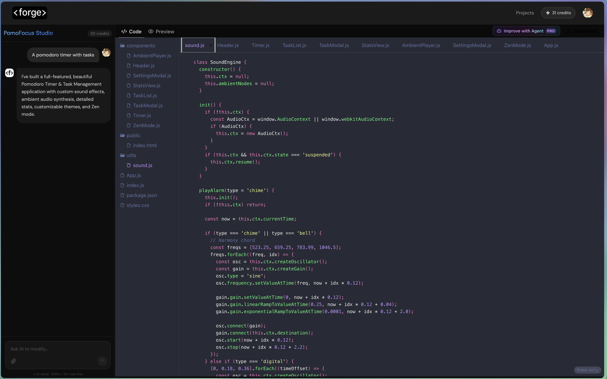
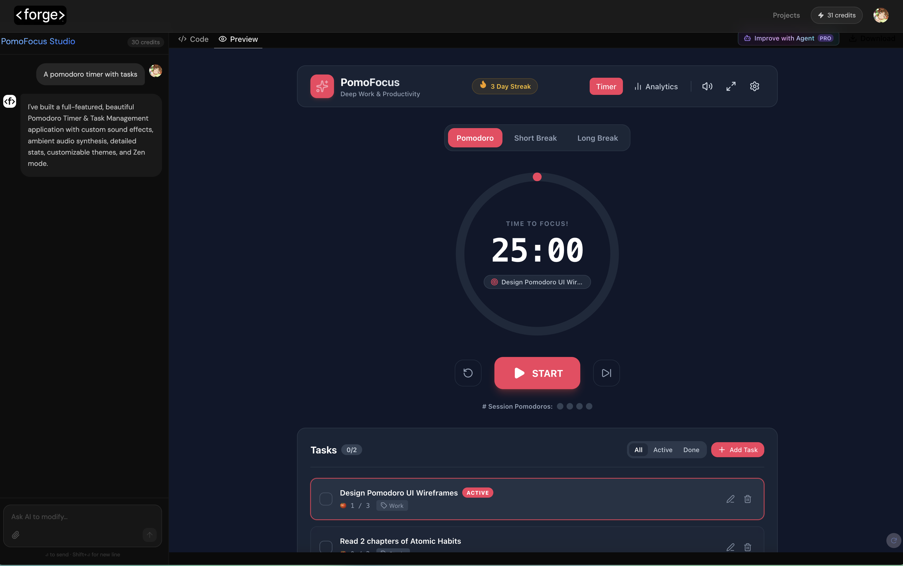

# ⚒️ Forge AI

Forge AI is an AI-powered full-stack application builder inspired by Loveable. Describe the application you want to build in natural language, and Forge AI generates a complete project with a live preview, editable source code, automatic dependency management, AI-assisted debugging, and version history.

The goal is to make building applications feel like collaborating with an AI software engineer while still giving developers full control over the generated code.

---

## ✨ Features

- 🧠 Generate complete full-stack applications from natural language prompts
- ⚡ Live preview while the application is being generated
- 📁 Built-in file explorer
- 💻 Integrated code editor
- 📦 Automatic framework and dependency installation
- 🔒 Secure sandboxed execution using Sandpack
- 🐞 AI-powered runtime error detection and automatic bug fixing
- 📜 Version history for AI generations and fixes
- 📥 Export projects as ZIP files for local development

---

## 🛠 Tech Stack

### Frontend

- Next.js
- React
- TypeScript
- Tailwind CSS
- shadcn/ui

### Backend

- Next.js Route Handlers
- Supabase
- Clerk Authentication

### AI & Infrastructure

- Google Gemini API
- Cline
- Sandpack
- Arcjet

---

## 🚀 How It Works

1. Describe the application you want to build.
2. Forge AI plans the project structure.
3. Required dependencies are installed automatically.
4. The application is generated and executed inside a secure sandbox.
5. Runtime errors are detected and analyzed.
6. AI attempts to automatically fix issues using project context.
7. Every generation is stored, allowing previous versions to be restored.
8. Export the finished project as a ZIP and continue development locally.

---

## 📸 Preview

| Landing Page |
|--------------|-----------|
|  |  |

| Workspace | Code Editor |
|---------------|-------------|
|  |  |

| Live Preview |
|---------------|
|  |

---

## ⚙️ Running Locally

Clone the repository

```bash
git clone https://github.com/yourusername/forge-ai.git

cd forge-ai
```

Install dependencies

```bash
npm install
```

Start the development server

```bash
npm run dev
```

---

## 🔑 Environment Variables

Create a `.env.local` file.

```env
# Clerk Authentication
NEXT_PUBLIC_CLERK_PUBLISHABLE_KEY=
CLERK_SECRET_KEY=

NEXT_PUBLIC_CLERK_SIGN_IN_URL=/sign-in
NEXT_PUBLIC_CLERK_SIGN_UP_URL=/sign-up

# Arcjet
ARCJET_KEY=

# PostgreSQL
DATABASE_URL=
DIRECT_URL=

# Supabase
NEXT_PUBLIC_SUPABASE_URL=
NEXT_PUBLIC_SUPABASE_ANON_KEY=

# Gemini
GEMINI_API_KEY=
```

---

## 🗺️ Roadmap

### ✅ Completed

- Responsive frontend
- Authentication with Clerk
- Backend using Next.js Route Handlers
- AI generation workflow
- Built-in code editor
- File explorer
- Secure sandbox execution
- Live preview
- Version history
- Export projects as ZIP

### 🚧 Planned

- Fuzzy search
- Bring Your Own AI API Key (Gemini, OpenAI, Anthropic, etc.)
- Multi-model support
- GitHub repository export

---

## 📚 What I Learned

Forge AI was my first project using **Next.js as a full-stack framework**, giving me hands-on experience building both the frontend and backend in a single application.

Through this project, I explored:

- Building backend APIs with Next.js Route Handlers
- Authentication using Clerk
- Database integration with Supabase
- Creating reusable UI with shadcn/ui
- AI integration with the Gemini API
- Streaming AI responses for a better user experience
- Runtime error detection and AI-assisted debugging
- Managing application state and version history
- Working with a sandboxed execution environment using Sandpack
---

## ⚠️ Current Limitations

- Uses the free Gemini API tier
- Large prompts may exceed API limits
- Complex projects may require multiple generations
- Bring Your Own API Key support will implement soon 

---

## 🤝 Contributing

Contributions, feature requests, and suggestions are always welcome.

Feel free to open an issue or submit a pull request.

---

## 📄 License

This project is licensed under the MIT License.
